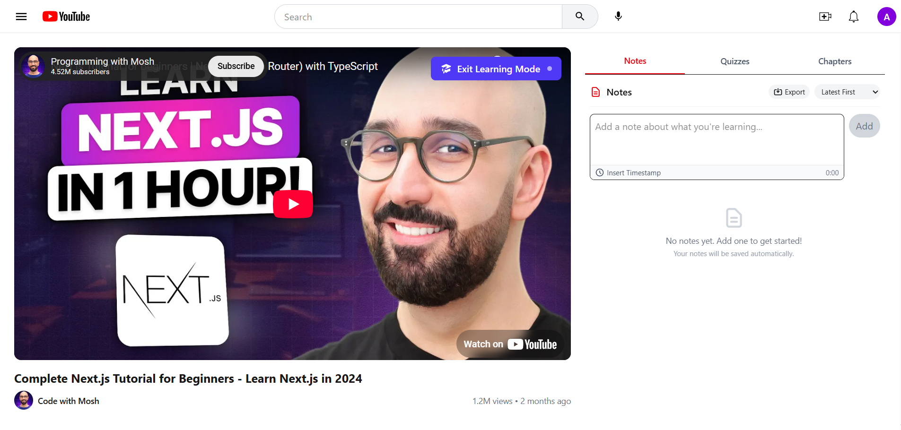
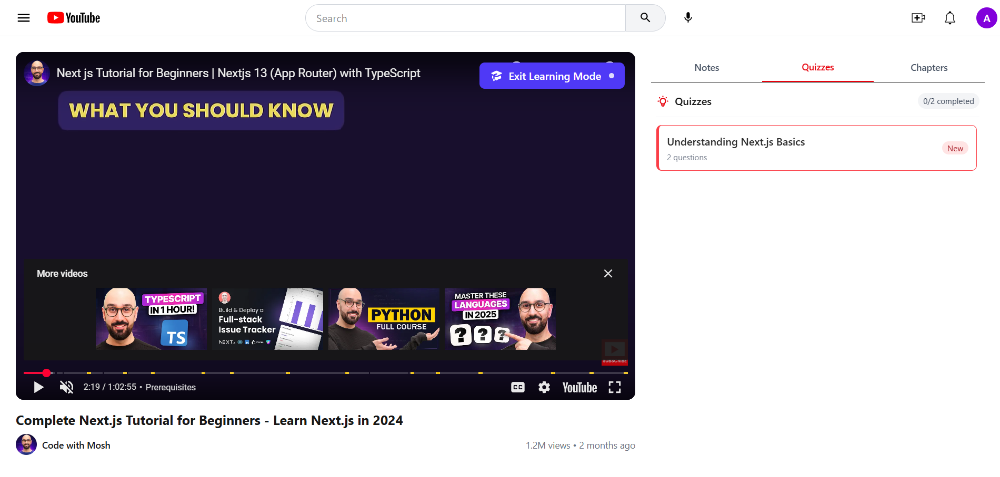
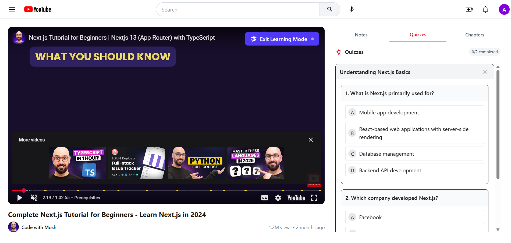
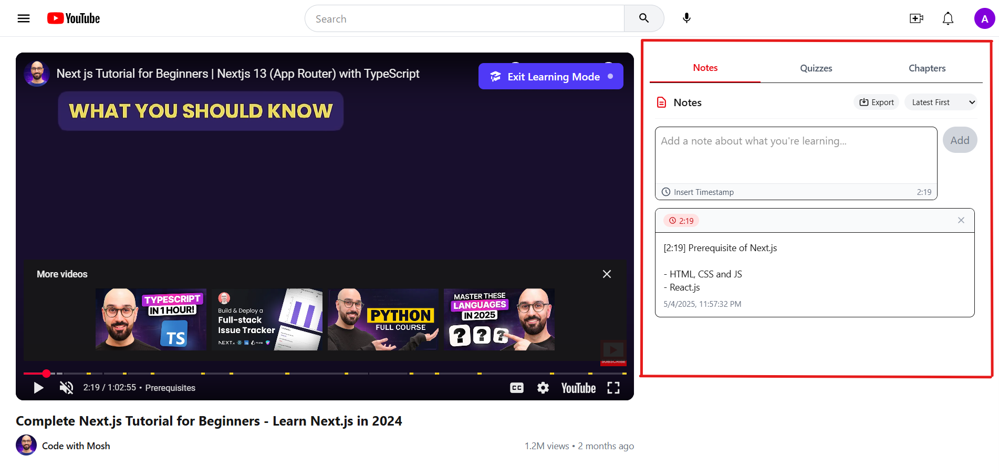
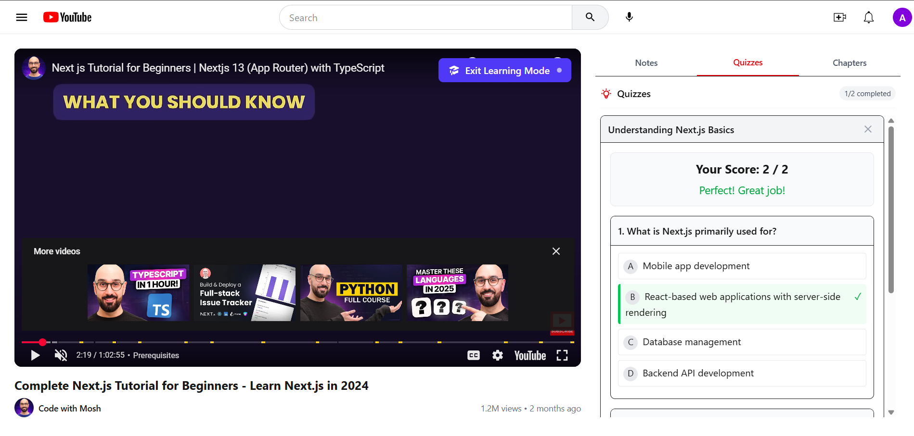

# LearnTube 🎓

<div align="center">
  
  <p><em>Transform YouTube videos into interactive learning experiences</em></p>
  
  [](https://vibecoding.com)
  [](https://nextjs.org/)
  [](https://www.typescriptlang.org/)
  [](LICENSE)
</div>

## 🌟 Overview

**LearnTube** reimagines how we learn from YouTube videos by transforming passive watching into an active, educational experience. Created for the **Level Up: Vibe Coding Hackathon**, this platform adds powerful learning tools directly alongside YouTube content, making educational videos significantly more effective.

> 💡 **The Problem**: YouTube has amazing educational content, but lacks learning-specific features. Learners constantly switch between the video and note-taking apps, losing context and focus.

> 🚀 **Our Solution**: LearnTube integrates learning tools directly with YouTube videos in a thoughtfully designed interface that maximizes learning effectiveness.

<div align="center">
  
  <p><em>LearnTube's Learning Mode with video playback and interactive learning tools</em></p>
</div>

## ✨ Key Features

### 🎓 Learning Mode
- **Split-view Interface**: Watch videos and interact with learning tools simultaneously
- **Toggle**: Switch between standard YouTube experience and Learning Mode with one click

### 📝 Enhanced Note-Taking
- **Timestamped Notes**: Automatically associate notes with video timestamps
- **Quick Insert**: Add the current timestamp to your note with one click
- **Jump-to-Timestamp**: Click any note's timestamp to navigate to that part of the video
- **Export Options**: Save notes in multiple formats (Text, HTML, JSON)
- **Organization**: Sort notes by timestamp or creation date

### 📊 Interactive Quizzes
- **Time-Based Delivery**: Quizzes appear at relevant points in the video
- **Immediate Feedback**: Learn from explanations for incorrect answers
- **Progress Tracking**: See scores and completion status
- **Notifications**: Be alerted when new quizzes become available

### 📑 Chapter Navigation
- **Visual Timeline**: Navigate video content by sections and topics
- **Quick Access**: Jump to specific parts of the video with one click

### 🎮 User Experience
- **YouTube-Style UI**: Familiar interface that builds on YouTube's design language
- **Responsive Layout**: Works on desktop and tablet devices
- **Persistent State**: Your notes and progress are saved automatically

## 🛠️ Technologies

- **Frontend Framework**: Next.js 15 (App Router)
- **Language**: TypeScript
- **Styling**: Tailwind CSS
- **Animation**: Framer Motion
- **Video Integration**: YouTube iFrame API
- **State Management**: React Context API
- **Data Persistence**: LocalStorage (with JSON serialization)

## 📷 Screenshots

<div align="center">
  
  
  <p><em>Left: Standard video viewing mode. Right: Quiz notification appears during video.</em></p>
  
  
  
  <p><em>Left: Note-taking interface with timestamp insertion. Right: Quiz results with explanations.</em></p>
</div>

## 🚀 Setup & Installation

1. **Clone the repository**
   ```bash
   git clone https://github.com/adityasharmahub/learntube.git
   cd learntube
   ```

2. **Install dependencies**
   ```bash
   npm install
   # or
   yarn install
   ```

3. **Run the development server**
   ```bash
   npm run dev
   # or
   yarn dev
   ```

4. **Open [http://localhost:3000](http://localhost:3000) in your browser**

## 🏆 Hackathon Submission

This project was created for the **Level Up: Vibe Coding Hackathon** with the goal of reimagining how educational content can be delivered on the web. LearnTube demonstrates:

- **Innovation**: Seamlessly integrates learning tools with video content
- **Technical Excellence**: Clean architecture and smooth YouTube API integration
- **UX Focus**: Intuitive design that solves real user problems
- **Educational Value**: Transforms passive content into active learning
- **Completeness**: Fully functional prototype with polished features

## 📈 Future Roadmap

- **AI-Generated Quizzes**: Automatically create quizzes from video content
- **Collaborative Notes**: Share and collaborate on notes with classmates
- **Spaced Repetition**: Smart review system for better knowledge retention
- **Custom Courses**: Organize multiple videos into structured courses
- **Mobile App**: Native mobile experience for on-the-go learning

## 🙏 Acknowledgements

- **Vibe Coding Hackathon** for the inspiration and opportunity
- **Educational YouTube Creators** who make learning accessible to everyone
- **Open Source Community** for the amazing tools that made this project possible

---

<div align="center">
  <p>Built with ❤️ for learners everywhere</p>
  <a href="https://github.com/adityasharmahub/learntube/issues">Report Bug</a> ·
  <a href="https://github.com/adityasharmahub/learntube/issues">Request Feature</a>
</div>
